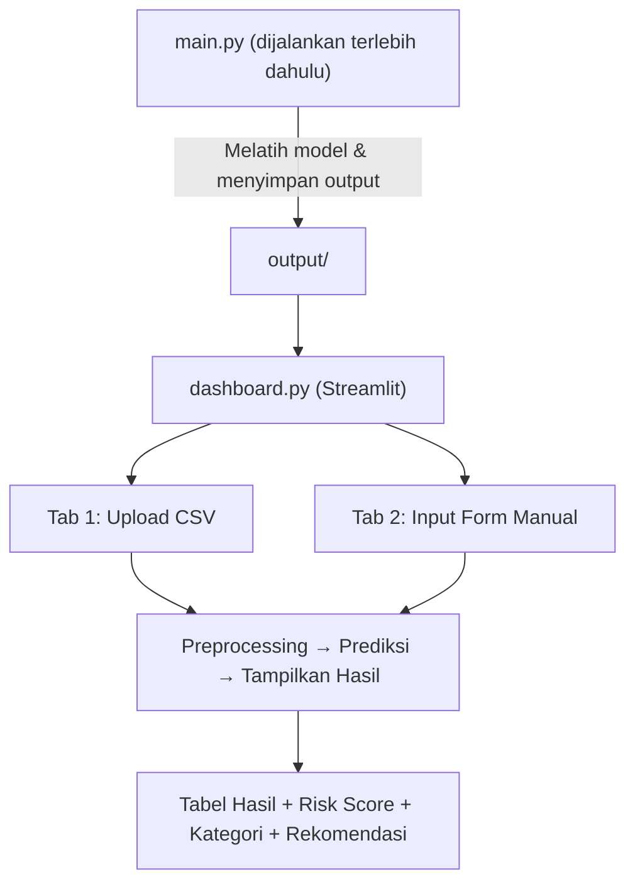

# Dashboard Streamlit - Deteksi Fraud Reimbursement Perjalanan Dinas

## Deskripsi

Membuat dashboard Streamlit sederhana sebagai antarmuka auditor untuk mendeteksi fraud pengajuan reimbursement perjalanan dinas. Dashboard memanfaatkan model Decision Tree yang sudah dilatih di `main.py` dan menyediakan 2 tab input: **Upload CSV** dan **Input Manual**.

---

## Arsitektur & Alur Kerja



**Alur:**
1. `main.py` dijalankan terlebih dahulu → melatih model, menyimpan visualisasi & metrics ke `output/`
2. `dashboard.py` me-load dataset yang sama, melatih ulang model dengan parameter identik, lalu siap menerima input dari auditor
3. Auditor memilih tab → input data → sistem melakukan prediksi → menampilkan hasil

> [!IMPORTANT]
> Model akan **dilatih ulang** saat dashboard dijalankan (menggunakan parameter & pipeline yang sama dengan `main.py`). Ini untuk menghindari dependency pada file `.pkl` dan menjaga konsistensi.

---

## User Review Required

> [!WARNING]
> **Pilihan arsitektur model:** Saya memilih melatih ulang model di dalam `dashboard.py` daripada menyimpan/load file pickle. Alasannya:
> - Lebih sederhana, tidak perlu mengelola file `.pkl` tambahan
> - Menjamin konsistensi pipeline (encoder, scaler, model)
> - Cocok untuk tugas besar (bukan production)
> 
> Kalau kamu lebih suka pakai **file pickle** (lebih cepat loading), beritahu saya.

> [!IMPORTANT]
> **Fitur form manual** menggunakan 8 fitur yang sudah ditentukan di `main.py`:
> 1. `jenis_perjalanan` → Dropdown: dalam kota, luar kota, luar negeri
> 2. `nominal_klaim` → Number input (Rp)
> 3. `nominal_standar` → Otomatis dihitung dari rata-rata per jenis perjalanan
> 4. `kelengkapan_dokumen` → Radio: Lengkap (1.0) / Tidak Lengkap (0.75)
> 5. `frekuensi_klaim_bulan` → Number input (integer)
> 6. `selisih_hari_pengajuan` → Number input (hari)
> 7. `jabatan_pegawai` → Dropdown: Staff, Supervisor, Manager
> 8. `riwayat_fraud` → Radio: Ya / Tidak
>
> Apakah ini sudah sesuai? Ada field yang ingin ditambah/ubah?

---

## Open Questions

1. **Apakah `nominal_standar` perlu bisa diinput manual?** Saat ini saya rencanakan otomatis dihitung dari rata-rata klaim per jenis perjalanan (dari data training). Atau auditor perlu bisa mengubahnya?
2. **Apakah perlu menampilkan visualisasi dari `output/` di dashboard?** (misal: confusion matrix, feature importance, decision tree) Atau cukup fokus ke input & prediksi saja?
3. **Apakah perlu fitur download hasil prediksi ke CSV?** (terutama untuk Tab Upload CSV)

---

## Proposed Changes

### Dashboard Application

#### [NEW] [dashboard.py](file:///c:/Users/craft/OneDrive/Documents/Dashboard%20Tubes%20ML/TugasBesar_ML/dashboard.py)

File utama dashboard Streamlit. Struktur kode:

**1. Header & Config**
```python
import streamlit as st
# ... imports
st.set_page_config(page_title="Fraud Detection - Auditor", layout="wide")
```

**2. Load Data & Train Model (cached)**
- Menggunakan `@st.cache_resource` agar model hanya dilatih sekali
- Pipeline identik dengan `main.py`:
  - Load `data/insurance_data.csv`
  - Feature engineering (8 fitur + target)
  - Label Encoding, Train/Test Split, MinMaxScaler, SMOTE
  - Train Decision Tree (`max_depth=5, criterion=gini, class_weight=balanced`)
- Return: `model`, `scaler`, `le_encoders`, `df` (untuk referensi nominal_standar)

**3. Sidebar** 
- Logo / judul kelompok
- Info model: accuracy, precision, recall, f1 (dari metrics yang dihitung)
- Info dataset: jumlah data, jumlah fraud/normal

**4. Tab 1: 📁 Upload CSV**
- `st.file_uploader` untuk upload file CSV
- Format CSV yang diharapkan (8 kolom sesuai fitur):

| Kolom | Tipe | Contoh |
|-------|------|--------|
| jenis_perjalanan | Text | dalam kota / luar kota / luar negeri |
| nominal_klaim | Angka | 5000000 |
| kelengkapan_dokumen | Angka | 1.0 atau 0.75 |
| frekuensi_klaim_bulan | Integer | 3 |
| selisih_hari_pengajuan | Integer | 5 |
| jabatan_pegawai | Text | Staff / Supervisor / Manager |
| riwayat_fraud | Integer | 0 atau 1 |

- `nominal_standar` dihitung otomatis dari rata-rata training data
- Preview data yang diupload
- Tombol **"Prediksi"**
- Hasil: tabel dengan kolom tambahan → `Prediksi`, `Risk Score`, `Kategori Risiko`, `Rekomendasi`
- Ringkasan: jumlah Low/Medium/High Risk
- Opsi download hasil ke CSV

**5. Tab 2: 📝 Input Manual**
- Form Streamlit (`st.form`) dengan field:
  - `jenis_perjalanan` → `st.selectbox`
  - `nominal_klaim` → `st.number_input`
  - `kelengkapan_dokumen` → `st.radio` ("Lengkap" / "Tidak Lengkap")
  - `frekuensi_klaim_bulan` → `st.number_input` (min=1)
  - `selisih_hari_pengajuan` → `st.number_input` (min=0)
  - `jabatan_pegawai` → `st.selectbox`
  - `riwayat_fraud` → `st.radio` ("Ya" / "Tidak")
- Tombol **"Submit & Prediksi"**
- Hasil ditampilkan sebagai card/metric:
  - Prediksi: **Fraud** / **Normal**
  - Risk Score: angka probabilitas
  - Kategori: Low / Medium / High Risk
  - Rekomendasi: Auto Approved / Manual Review / Auto Rejected
  - Warna visual sesuai kategori risiko (hijau/kuning/merah)

**6. Fungsi Prediksi (shared)**
```python
def predict_fraud(input_df, model, scaler, le_encoders, nominal_standar_map):
    # 1. Hitung nominal_standar dari map rata-rata
    # 2. Encode kolom kategorikal
    # 3. Scale kolom numerik
    # 4. model.predict() dan model.predict_proba()
    # 5. Kategorikan risiko & rekomendasi
    return hasil_df
```

---

## Struktur Folder Setelah Implementasi

```
TugasBesar_ML/
├── main.py                    (tidak diubah)
├── dashboard.py               [NEW] Dashboard Streamlit
├── data/
│   └── insurance_data.csv
└── output/
    └── ... (file output existing)
```

---

## Verification Plan

### Manual Verification
1. Install Streamlit jika belum: `pip install streamlit`
2. Jalankan: `streamlit run dashboard.py`
3. Test Tab 1: Upload contoh CSV → cek apakah prediksi muncul dengan benar
4. Test Tab 2: Isi form manual → cek apakah prediksi konsisten
5. Pastikan risk scoring threshold (0.30 / 0.60) sesuai dengan `main.py`
